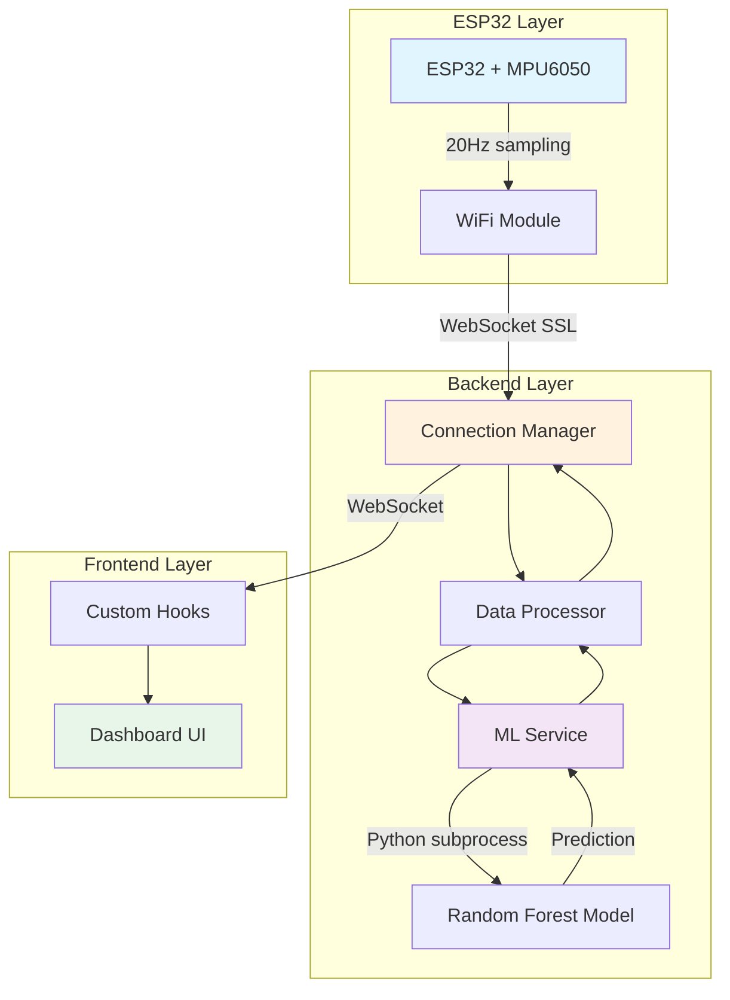

# System Architecture

## Overview

The Predictive Maintenance system uses a three-tier architecture with real-time WebSocket communication for low-latency machine health monitoring.



## Component Breakdown

### 1. IoT Layer (ESP32)

**Responsibility**: Real-time sensor data acquisition and transmission

**Components**:
- ESP32 WROOM 32 microcontroller
- MPU6050 6-axis accelerometer (I2C)
- WiFi connectivity
- WebSocket client (SSL capable)

**Data Flow**:
1. MPU6050 samples acceleration at 20Hz
2. ESP32 reads I2C data (X, Y, Z axes)
3. JSON payload created: `{X, Y, Z, timestamp}`
4. WebSocket transmission to backend

**Key Features**:
- Auto-reconnection on WiFi/WebSocket failure
- Configurable sample rate (default 50ms = 20Hz)
- SSL support for secure production deployment
- Debug logging (configurable)

---

### 2. Backend Layer (Node.js + Python)

**Responsibility**: WebSocket server, data processing, and ML inference

#### Architecture Modules

##### **Connection Manager** (`connectionManager.js`)
- Tracks sensor and dashboard clients
- Implements connection limits
- Handles client broadcasting
- Automatic cleanup of dead connections

##### **Data Processor** (`dataProcessor.js`)
- Maintains sliding window buffer (10 samples)
- Prepares data for ML inference
- Buffer size management

##### **ML Service** (`mlService.js`)
- Spawns Python subprocess for predictions
- Caches latest inference result
- Handles ML errors gracefully
- Model validation on startup

##### **Logger** (`logger.js`)
- Structured logging with levels (debug/info/warn/error)
- Color-coded console output
- Specialized logging for connections, predictions

##### **Config** (`config.js`)
- Centralized configuration
- Environment variable support
- Production/development modes

**Data Flow**:
1. WebSocket server receives sensor data at `/sensor`
2. Data added to buffer (10-point window)
3. When buffer full → extract features
4. Call Python ML script: `ml_predict.py`
5. Parse prediction result (prob_bad)
6. Apply confidence threshold (0.7)
7. Broadcast combined data + status to dashboards

**Performance**:
- Latency: < 100ms sensor → dashboard
- Throughput: 100+ messages/second
- Connection capacity:
  - 10 sensor clients max
  - 50 dashboard clients max

---

### 3. ML Layer (Python)

**File**: `ml_predict.py`

**Model**: Random Forest Classifier (scikit-learn)

**Features Extracted** (13 total):
1. Mean X, Y, Z
2. Std X, Y, Z  
3. RMS X, Y, Z
4. Magnitude mean
5. Magnitude max
6. Magnitude min
7. Peak-to-peak magnitude

**Prediction Output**:
```json
{
  "prob_bad": 0.82,
  "prob_good": 0.18
}
```

**Model File**: `pdm_binary.pkl` (327KB joblib)

---

### 4. Frontend Layer (Next.js + React)

**Responsibility**: Real-time visualization and user interface

#### Custom Hooks Architecture

##### **useWebSocketData**
- Manages WebSocket connection lifecycle
- Handles auto-reconnection (3s delay)
- Parses incoming messages
- Provides connection status

##### **useDataBuffer**
- Maintains visualization buffer (300 points = 3 seconds)
- Computes rolling averages for stats cards
- Tracks latest timestamp

##### **useConnectionStatus**
- Uptime tracking
- Formatted display (HH:MM:SS)

#### Components

##### **page.tsx** (Main Dashboard)
- Orchestrates hooks
- Updates machine status on new data
- Conditional rendering (waiting/active states)

##### **MachineStatusCard**
- Displays GOOD/BAD/READY
- Confidence percentage
- Color-coded visual feedback

##### **VibrationChart**
- Real-time line chart (Recharts)
- 300-point scrolling window
- Separate charts for X, Y, Z axes

##### **StatsCard**
- Current axis value
- Trend indicator
- Last update timestamp

**State Management**:
- No external state library needed
- React hooks for local state
- WebSocket for real-time sync
- Direct updates (no polling)

---

## Data Formats

### Sensor → Backend

```json
{
  "X": 1.23,
  "Y": -0.45,
  "Z": 9.81,
  "timestamp": 1234567890
}
```

### Backend → Dashboard

```json
{
  "X": 1.23,
  "Y": -0.45,
  "Z": 9.81,
  "timestamp": 1234567890,
  "state": "GOOD",
  "prob_bad": 0.23,
  "updated_at": 1234567890123
}
```

---

## Deployment Architecture

### Development

```
┌─────────┐     WiFi      ┌──────────┐    ws://    ┌──────────┐
│  ESP32  │ ────────────> │  Laptop  │ <────────── │ Browser  │
└─────────┘               │ Backend  │             │ :3000    │
                          │ :8765    │             └──────────┘
                          └──────────┘
```

### Production

```
┌─────────┐               ┌─────────────┐          ┌──────────┐
│  ESP32  │ ─── wss:// ──>│ Render.com  │<── wss ──│ Vercel   │
└─────────┘               │ (Backend)   │          │(Frontend)│
       SSL                │ Port 443    │          └──────────┘
                          └─────────────┘
                                 ↓
                          ┌─────────────┐
                          │ Python ML   │
                          │ subprocess  │
                          └─────────────┘
```

---

## Performance Characteristics

| Metric | Value | Notes |
|--------|-------|-------|
| **Sampling Rate** | 20Hz | Configurable in firmware |
| **End-to-end Latency** | < 100ms | Sensor → Dashboard |
| **ML Inference** | ~50ms | Per prediction window |
| **WebSocket Throughput** | 100+ msg/s | Per connection |
| **Dashboard Update** | 60 FPS | React rendering |
| **Data Retention** | 3 seconds | Frontend (300 points) |
| **Buffer Size** | 10 samples | ML window (0.5s) |

---

## Security

### Development Mode
- Plain WebSocket (ws://)
- No authentication
- Debug logging enabled

### Production Mode
- SSL WebSocket (wss://)
- Origin validation (configurable)
- Heartbeat monitoring
- Rate limiting (future)
- Secrets in environment variables

---

## Technology Decisions

### Why Node.js over Python for Backend?
1. **ESP32 Compatibility**: Better WebSocket support with Render's SSL proxy
2. **Performance**: Event-driven I/O perfect for streaming
3. **Ecosystem**: Easy dependency management with npm

### Why Keep Python for ML?
1. **Ecosystem**: scikit-learn is industry standard
2. **Model Training**: Existing pipeline already in Python
3. **Isolation**: Subprocess keeps ML crashes isolated

### Why WebSocket over HTTP/MQTT?
1. **Latency**: Bidirectional, persistent connection
2. **Simplicity**: No broker needed (vs. MQTT)
3. **Browser Support**: Native WebSocket API
4. **Efficiency**: No HTTP overhead per message

### Why Next.js over Plain React?
1. **SSR**: Fast initial page load
2. **Routing**: Built-in file-based routing
3. **Deployment**: Seamless Vercel integration
4. **TypeScript**: First-class support

---

## Scaling Considerations

### Current Limits
- 10 concurrent ESP32 devices
- 50 concurrent dashboard users
- Single-server deployment

### Future Scaling
- **Horizontal**: Load balancer + multiple backend instances
- **Vertical**: Increase connection limits via config
- **Database**: Add TimescaleDB for historical data
- **Caching**: Redis for aggregated stats
- **ML**: GPU acceleration for complex models

---

## Folder Structure Rationale

### Backend (`AI-ML/server/`)
- **Modular**: Each file has single responsibility
- **Testable**: Easy to mock dependencies
- **Configurable**: Single source of truth for settings

### Frontend (`frontend/lib/hooks/`)
- **Reusable**: Hooks can be used in multiple components
- **Separation**: Business logic separate from UI
- **Type-safe**: TypeScript throughout

---

## Maintenance

### Regular Tasks
- [ ] Monitor backend logs for errors
- [ ] Check health endpoint daily
- [ ] Review connection counts
- [ ] Retrain ML model monthly (as data grows)
- [ ] Update dependencies quarterly

### Emergency Procedures
1. **Backend crashes**: Auto-restart via Render
2. **ESP32 disconnects**: Auto-reconnect in firmware
3. **ML model unavailable**: Backend serves last known state
4. **Dashboard offline**: Cached service worker (future)

---

**Last Updated**: February 2026
