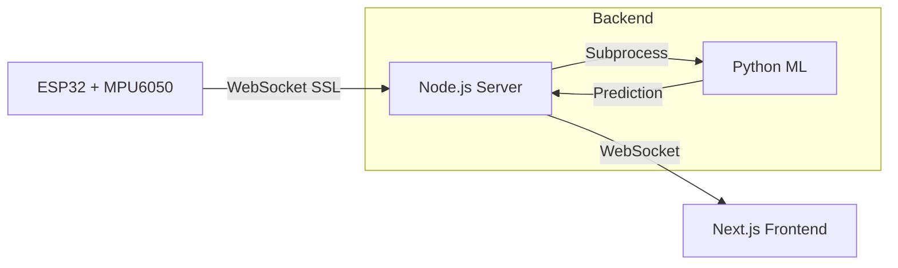

# Predictive Maintenance 2025

An **IoT + AI** system that detects early signs of equipment failure using ESP32, real-time WebSocket communication, and machine learning.

## 🚀 Quick Start

### Prerequisites
- **Hardware**: ESP32 WROOM 32, MPU6050 accelerometer
- **Software**: Node.js 18+, Python 3.8+, Arduino IDE
- **Cloud**: Optional (Render.com for production deployment)

### Local Development

```bash
# 1. Clone the repository
git clone https://github.com/Pongkai2006/predictive_maintenance_2025.git
cd predictive_maintenance_2025

# 2. Start Backend Server
cd AI-ML
npm install
npm run dev

# 3. Start Frontend (in new terminal)
cd frontend
npm install
npm run dev

# 4. Upload ESP32 Firmware
# Open IoT_firmware/ESP32_Direct_WS/ESP32_Direct_WS.ino in Arduino IDE
# Configure WiFi credentials and WebSocket URL
# Upload to ESP32

# 5. Access Dashboard
# Open http://localhost:3000
```

## 📁 Project Structure

```
predictive_maintenance_2025/
├── IoT_firmware/           # ESP32 firmware
│   ├── ESP32_Direct_WS/    # ✓ Current firmware (WebSocket)
│   └── _deprecated/        # Old Firebase-based firmwares
├── AI-ML/                  # Backend server + ML
│   ├── server/             # ✓ Modular Node.js backend
│   │   ├── index.js        # Main entry point
│   │   ├── config.js       # Configuration
│   │   ├── logger.js       # Structured logging
│   │   ├── connectionManager.js  # WebSocket clients
│   │   ├── mlService.js    # ML predictions
│   │   └── dataProcessor.js # Data buffering
│   ├── ml_predict.py       # Python ML script
│   ├── pdm_binary.pkl      # Trained model
│   ├── class_train.py      # Model training script
│   └── _deprecated/        # Old Python/monolithic backends
├── frontend/               # Next.js dashboard
│   ├── app/                # Pages
│   │   └── page.tsx        # Main dashboard
│   ├── components/         # React components
│   │   ├── MachineStatusCard.tsx
│   │   ├── VibrationChart.tsx
│   │   └── StatsCard.tsx
│   ├── lib/
│   │   ├── hooks/          # Custom React hooks
│   │   │   ├── useWebSocketData.ts
│   │   │   ├── useConnectionStatus.ts
│   │   │   └── useDataBuffer.ts
│   │   └── types.ts        # TypeScript types
│   └── _deprecated/        # Old Firebase service
├── data/                   # Training data
│   ├── raw/                # Raw sensor data
│   └── processed/          # Preprocessed data
├── signal_processing/      # Data preprocessing scripts
└── docs/                   # Documentation
```

## 🏗️ System Architecture



### Data Flow

1. **ESP32** samples vibration data at 20Hz (X, Y, Z accelerations)
2. **WebSocket** streams data to Node.js backend with < 100ms latency
3. **Buffer** collects 10 samples for feature extraction
4. **ML Model** predicts GOOD/BAD state using Random Forest
5. **Dashboard** displays real-time graphs and machine status

## 🛠️ Tech Stack

| Component | Technology |
|-----------|-----------|
| **MCU** | ESP32 WROOM 32 |
| **Sensor** | MPU6050 6-axis accelerometer |
| **Firmware** | Arduino (C++) |
| **Backend** | Node.js + Express + WebSocket |
| **ML** | Python + scikit-learn + joblib |
| **Frontend** | Next.js 16 + TypeScript + React |
| **Styling** | Tailwind CSS |
| **Charts** | Recharts |
| **Deployment** | Render.com (backend), Vercel (frontend) |

## 📊 Features

- ✅ **Real-time monitoring** - 20Hz sensor data with live charts
- ✅ **AI predictions** - Machine learning-based fault detection
- ✅ **Low latency** - < 100ms end-to-end via WebSocket
- ✅ **Modular architecture** - Clean separation of concerns
- ✅ **Production ready** - SSL support, health checks, graceful shutdown
- ✅ **Developer friendly** - TypeScript, structured logging, hot reload

## 🧪 ML Model

- **Algorithm**: Random Forest Classifier
- **Features**: Mean, std, RMS, magnitude statistics from 3-axis vibrations
- **Window Size**: 10 samples (0.5 seconds at 20Hz)
- **Confidence Threshold**: 70%
- **Training Data**: Normal vs. faulty machine vibration patterns

## 🔧 Configuration

### ESP32 (Firmware)

Edit `IoT_firmware/ESP32_Direct_WS/ESP32_Direct_WS.ino`:

```cpp
const char* ssid = "Your_WiFi";
const char* password = "Your_Password";
const char* ws_host = "localhost";  // or "your-app.onrender.com"
const int ws_port = 8765;  // or 443 for SSL
const bool DEBUG_MODE = true;  // Set false for production
```

### Backend (Node.js)

Create `.env` file in `AI-ML/`:

```bash
PORT=8765
LOG_LEVEL=info
CONFIDENCE_THRESHOLD=0.7
WINDOW_SIZE=10
NODE_ENV=development
```

### Frontend (Next.js)

Edit `frontend/lib/hooks/useWebSocketData.ts`:

```typescript
const WS_URL = 'ws://localhost:8765';  // Local
// const WS_URL = 'wss://your-backend.onrender.com';  // Production
```

## 📈 Monitoring

### Health Check

```bash
curl http://localhost:8765/health
```

Response:
```json
{
  "status": "OK",
  "uptime": 123.45,
  "connections": {
    "sensors": 1,
    "dashboards": 2
  },
  "buffer": {
    "size": 10,
    "ready": true
  },
  "latestInference": {
    "state": "GOOD",
    "prob_bad": 0.23
  }
}
```

## 🚢 Deployment

### Backend (Render.com)

1. Push to GitHub
2. Create new Web Service on Render
3. Set build command: `npm install`
4. Set start command: `npm start`
5. Environment: `NODE_ENV=production`

### Frontend (Vercel)

```bash
cd frontend
vercel deploy --prod
```

## 📝 Development Workflows

### Training New ML Model

```bash
cd AI-ML
python class_train.py  # Generates pdm_binary.pkl
```

### Running in Debug Mode

```bash
# Backend with debug logging
cd AI-ML
LOG_LEVEL=debug npm run dev

# Frontend with logging
cd frontend
npm run dev

# ESP32 - Set DEBUG_MODE = true in firmware
```

## 🤝 Contributing

1. Fork the repository
2. Create feature branch (`git checkout -b feature/amazing-feature`)  
3. Commit changes (`git commit -m 'Add amazing feature'`)
4. Push to branch (`git push origin feature/amazing-feature`)
5. Open Pull Request

## 📄 License

This project is part of the KOSEN-KMITL PBL 2025 program.

## 👥 Team

**Predictive Maintenance Team**
- KOSEN-KMITL
- PBL 2025

---

**Last Updated**: February 2026 ✨
